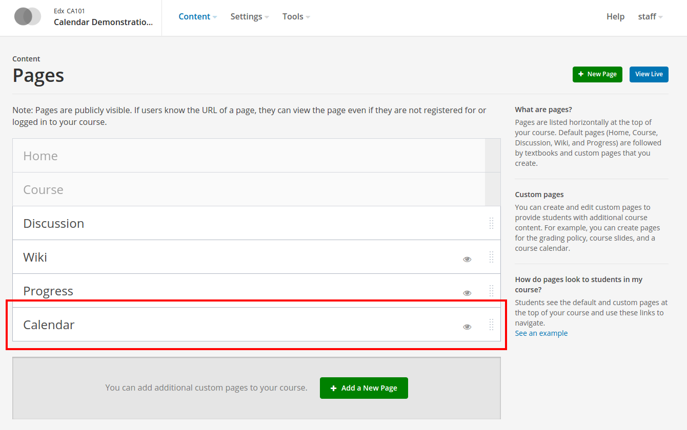

# edx-calendar-tab

Shared calendar for Open edX Courseware

Django application that allows course staff enable new "Calendar" tab
from CMS (studio).
From LMS side appears new "Calendar" tab with google calendar
associated with current course.
New calendar events may be created by any enrolled student.
Calendar may be shared by stuff personal with provided google accounts
(with update permission).

## Installation

    sudo -sHu edxapp
    cd
    . edxapp_env
    pip install -e git+https://github.com/raccoongang/edx-calendar-tab.git@master#egg=edx-calendar-tab

Django's collectstatic should be performed (change to --settings=devstack for devstack installation):

    python edx-platform/manage.py lms collectstatic --settings=aws --noinput

## Configuration

### Configure google service account

Google service accounts [documentation](https://developers.google.com/identity/protocols/OAuth2ServiceAccount).

In general process consists of these steps:

* create new Project in [developers console](https://console.developers.google.com/projectselector/iam-admin/serviceaccounts);

* create new Service Account via Project (with "Owner" role);

* [enable] Google Calendar API via Project;

[enable]: https://console.developers.google.com/apis/dashboard

* [create] credentials for Service Account (service account key)

* save json-api-private-key - _you'll need to put it on your server
  (into "/edx/app/edxapp/", for example_);

[create]: https://console.developers.google.com/apis/credentials

### Configure edx-platform

Add "edx-calendar-tab" to installed Django apps

In "/edx/app/edxapp/lms.env.json" add:

    "ADDL_INSTALLED_APPS": ["calendar_tab"],

and to the list of FEATURES add:

    "ENABLE_CALENDAR": true,
    "GOOGLE_CALENDAR_TAB_PRIVATE_KEY_URL": "/edx/app/edxapp/edx-calendar-tab-google-api-private-key.json"

In "/edx/app/edxapp/edx-platform/lms/urls.py" add __before__
static_tab urls:

    if settings.FEATURES.get('ENABLE_CALENDAR'):
        urlpatterns += (
           url(
               r'^courses/{}/tab/calendar/'.format(
                   settings.COURSE_ID_PATTERN,
               ),
               include('calendar_tab.urls'),
               name='calendar_tab_endpoints',
           ),
        )

## Basic usage

From the very beginning after calendar tab is enabled, there is no
any google calendar associated with current course, so staff has to
initialize one at first time by submitting "Initiate course google
calendar" button.

Application then creates new Google Calendar (from behalf of Google
service account) and associates it with the current Course.
This Calendar is private and can't be seen out of service account.

After initialization new google calendar is rendered on the tab.

Students and Staff can create/update/delete events.
Students can't update/delete event they don't own.
Staff can.

Events may be edited via dialog box(on double click), by dragging
(whole event or its start/end border).

ADDITIONAL NOTES:

  As the [Open edX documentation] says:

    The course stores a static list of its tabs in the database, and
    this list is only updated when one of the following actions take place:
    - You create a new course.
    - You update the advanced settings for your course.
    This means that if you have a pre-existing course then it won't
    immediately show a tab even after you've registered the new entry point.

[Open edX documentation]: https://openedx.atlassian.net/wiki/display/AC/Adding+a+new+course+tab

## Installed

After installation you should get the following state.

* Studio's Content/Pages has Calendar page:

* LMS's main menu (tabs) has Calendar tab:

